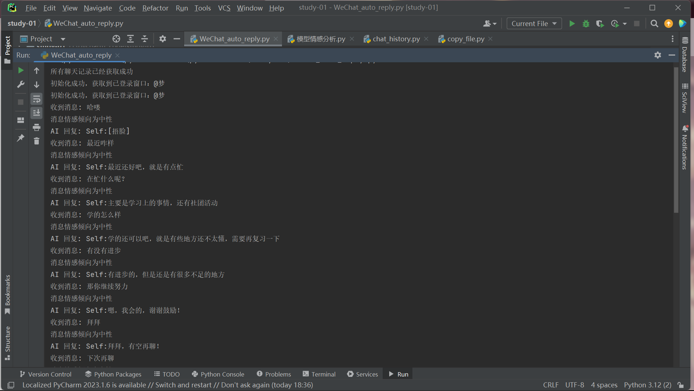

# 微信聊天记录处理与自动回复项目

## 项目简介

这是一个专注于微信聊天记录处理与自动回复的创新项目，致力于提供全面且便捷的聊天记录管理和互动解决方案。该项目的核心功能包括：

### 聊天记录获取

能够精准获取指定联系人或群聊的详细聊天记录，为后续分析和处理提供丰富的数据基础。

### 情感分析模型训练

基于获取的聊天记录，运用先进的自然语言处理技术进行情感分析，并通过训练模型不断优化分析的准确性。

### 微信自动回复功能

实现智能化的微信自动回复，根据消息的情感倾向生成合适的回复内容，提升聊天互动的效率和质量。

### 效果如下图




## 项目特点

### 自动化操作高效

充分利用 `wxauto` 库的强大功能，实现微信的自动化操作，如无缝切换聊天窗口、实时获取消息、快速发送消息等，极大地提高了工作效率，减少了人工操作的繁琐和时间成本。

### 模型可定制灵活

用户可以根据自己的具体需求和数据特点，自由选择不同的预训练模型进行训练，同时还可以灵活调整训练参数，如学习率、批次大小等，以达到更好的训练效果，满足个性化的需求。

### 错误处理机制完善

在请求星火大模型和解析响应的过程中，加入了全面的错误处理机制。当出现网络异常、服务器故障或解析错误等问题时，能够及时返回预设的错误回复，确保程序的稳定性和可靠性，避免因错误而导致的程序崩溃或异常中断。

## 不足之处

### 性能存在瓶颈

- 在处理大规模聊天记录时，由于数据量的急剧增加和计算复杂度的提升，可能会出现性能瓶颈，导致程序运行速度变慢，影响用户体验。
- 训练模型是一个计算密集型任务，需要较长的时间和较高的计算资源，可能需要具备一定的硬件条件才能顺利完成训练过程。

### 依赖库兼容性问题

部分依赖库可能存在版本兼容性问题，不同版本的库可能会导致代码无法正常运行或出现意想不到的错误。用户需要手动调整库的版本，以确保项目的正常运行，这增加了用户的使用难度和维护成本。

### 功能存在局限性

- 自动回复功能主要依赖于星火大模型，当模型服务不可用时，自动回复功能将受到严重影响，无法正常工作。
- 情感分析目前只考虑了消息的文本内容，可能会导致情感分析结果不准确，无法全面反映真实情感意图。

## 使用说明

### 1. 获取聊天记录

运行 `chat_history.py` 文件，将 `contact_name` 变量替换为你要获取聊天记录的联系人或群聊名称，即可获取聊天记录并保存到本地文件。

python

```python
contact_name = "你的联系人或群聊名称"
```

### 2. 训练模型

运行 `训练AI.py` 文件，该脚本会读取指定联系人的聊天记录文件，进行情感分析并添加标签，然后使用这些数据训练一个情感分析模型，最后将训练好的模型保存到本地。在运行前，请确保已经安装了所有依赖库，并将 `local_model_path` 变量替换为你本地的预训练模型路径。

python

```python
local_model_path = "你的本地预训练模型路径"
```

### 3. 自动回复

运行 `WeChat_auto_reply.py` 文件，脚本会监听指定联系人或群聊的新消息，根据消息情感倾向调用星火大模型生成回复并发送。在运行前，请确保已经获取了聊天记录文件，否则脚本会先获取聊天记录。

## 依赖库

### wxauto

用于实现微信的自动化操作，如切换聊天窗口、获取消息、发送消息等。

### transformers

用于加载和训练预训练模型，提供了丰富的模型和工具，方便用户进行自然语言处理任务。

### torch

强大的深度学习框架，支持 GPU 加速，能够高效地训练和部署深度学习模型。

### requests

用于发送 HTTP 请求，方便与外部 API 进行交互，如请求星火大模型的服务。

### nltk

自然语言处理工具包，提供了丰富的语料库和工具，这里主要用于情感分析。

## 安装与配置

在运行本项目的脚本前，请确保已经安装了所有依赖库，可以使用 `pip install` 命令进行安装。例如：

```bash
pip install wxauto transformers torch requests nltk
```

同时，请将 `模型情感分析.py` 文件中的 `local_model_path` 变量替换为你本地的预训练模型路径，确保模型能够正确加载。

## 注意事项

- 运行 `WeChat_auto_reply.py` 文件时，请确保已经获取了聊天记录文件，否则脚本会先获取聊天记录。

## 免责声明

本项目仅供学习和研究使用，不保证其适用于任何特定的生产环境。在使用本项目的过程中，用户需自行承担因使用本项目的代码、数据或模型所产生的任何风险和后果，开发者不对因使用本项目而导致的任何直接或间接损失承担任何责任。

使用者在使用本项目前，应仔细评估其适用性，并确保遵守所有适用的法律法规。此外，本项目可能依赖于第三方服务（如星火大模型），这些服务的可用性和稳定性不受开发者控制。

## 贡献指南

欢迎大家为这个项目贡献自己的力量！如果你发现了任何问题或者有新的功能建议，欢迎提交 issue 或者 pull request。

### 提交 issue

如果你发现了项目中的 bug 或者有任何疑问，可以在 issue 中详细描述问题，包括复现步骤、预期结果和实际结果等，以便开发者能够更好地理解和解决问题。

### 提交 pull request

如果你有新的功能或者改进建议，可以通过提交 pull request 来贡献代码。在提交之前，请确保你的代码符合项目的代码风格和规范，并通过了所有的测试。
